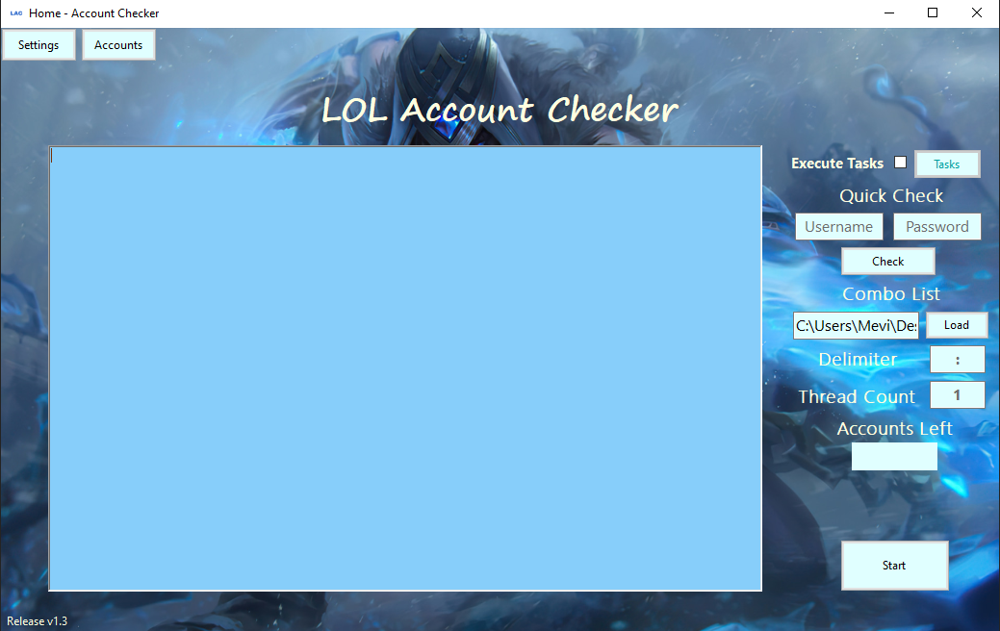

# LoL Account Checker

This program is a League of Legends account checker supporting multi threading with multiple features including the ability to run checks on multiple accounts, export all account information to a folder, and display comprehensive details about each account, including purchase dates and more.

## Core Features

- Multi-threading
- Run checks on multiple accounts (from text file)  
- Exports all accounts information to folder  
- Comprehensive details on each successfully checked account, including purchase dates, owned champions, owned skins, and more.  

## How to use

*Note: I recommend using at most 4 threads currently*  
*Note: Rarely, accounts can show as login failed when they are active. A new change that is being worked on will fix this soon.*

### First Way

The first way to run the application is by downloading the source code and running it in a coding environment like visual studio.

### Second Way

*Only works on Windows operating systems.*

The other way which is easier is to download the **Account Checker Release** found in the root folder of the directory. Running the exe file should run the application.

## How it works
The program creates a Riot client to authenticate the user and a League client to authorize requests. It then performs a series of requests to gather account-related data.

## Requirements
- An installation of Riot/League  
- A League of Legends account

## Not Yet Implemented
- Opening and disenchanting of Hextech loot  
- Claiming event rewards and spending event tokens  
- Custom exports  
- Re-queue system for failed accounts

## Application & Usage

### Main

The main process that runs the whole account checking operation. It includes an option to choose the combo list which is the account text file (typically looks like {username}{delimiter}{password} eg. user:pass). The delimiter is the character that splits the username and password. 

### Settings

Must be set up before being granted access to the main view. It includes the "RiotClientServices.exe location" and "LeagueClient.exe location" paths, as well as an option to update skins and champions to keep the checker up-to-date with new releases.

### Accounts

Lists all the accounts in the Exports folder in a grid view that displays general information about each account. Clicking on a specific row will open a view with more details about the account.

### Single Account

*Currently working on Tasks.*

Lists the overview information of the specific account, including the purchase history, owned champions, and skins. This view also displays specific details about each owned champion and skin.

## Inspiration

This project was inspired by DeivatorZ's account checker which can be found at https://github.com/DeviatorZ/league-account-checker
